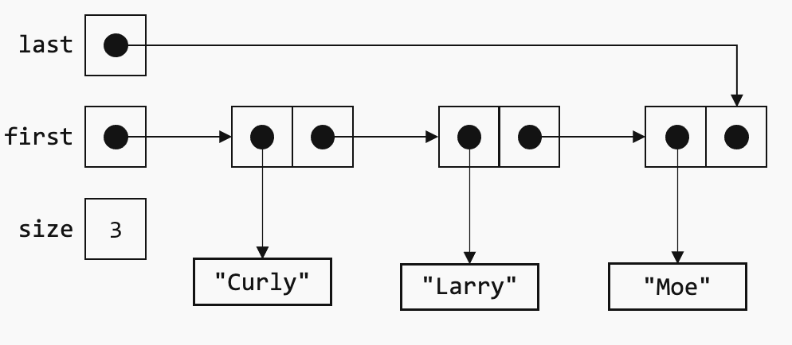

# Programming Assignment: Singly-LinkedList with Iterator
## CSCI 603: Object-Oriented Design Patterns

### Description
* A list (also known as a sequence or vector) is an ordered collection.  Elements can be accessed by their integer index.  There are several alternatives for implementing a list, but most commonly a list is implemented using either arrays or a linked data structure.  This assignment uses a singly linked data structure for implementing a list. 
* Implement the class **LinkedList** whose skeleton is given.  You may modify the private parts of the LinkedList class as desired, but you should not modify the public parts as specified.  I have provided two Java programs that test your LinkedList class, but feel free to write additional test programs. You can access both in **Main.java**.
* Note that the **LinkedList** class implements interface **Iterable** (i.e., it has a method named `iterator()` that returns an Iterator object.  This allows the LinkedList class to be used in a Java enhanced for-loop. 

```java
   LinkedList<String> strings = new LinkedList<String>(); 
 
   ...  // add some strings to the list 
 
   for (String s : strings) 
       System.out.println(s);
```
* Also note that implementing interface **Iterable** gives you a `forEach()` method for free (default method in interface **Iterable**) that allows a lambda expressions as the parameter. 
 
```java
   names.forEach(name -> System.out.println(name));
```
* A linked list is implemented using two references, one for the first node in the list and one for the last node.  Each node in the list contains a reference to the node’s value and a reference to the next node in the list.  The last node contains a null reference indicating that there is no “next” node.  An integer value keeps track of the size of the list.  For example, for a list of strings, after adding values “Curly,” “Larry,” and “Moe” in that order to an initially empty list, the list could be visualized as follows:



### Submission Instructions
* Fork this repl and complete the missing parts of the `LinkedList` class. 
* Submit the link to your repl through Canvas

---

**Repl Link:** [https://replit.com/@jtravan3/Singly-Linked-List-with-Iterator](https://replit.com/@jtravan3/Singly-Linked-List-with-Iterator#README.md)